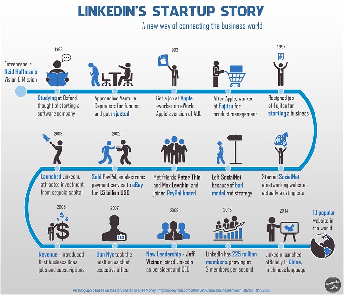

# How to Apply

## How do I apply for life insurance?

Applying for life insurance doesn't have to be hard. We are transforming the process to make it as simple as possible. The entire process can be summed up into 6 steps:

1. Apply
2. Sign
3. TI/Para
4. Underwriting
5. Decision
6. Accept/Decline

The flowchart below describes the steps.

## How do you buy life insurance?

There are three main ways to buy life insurance:

1. You can go directly to a life insurance company online (like TD bank)
2. You can go through an independent local insurance broker
3. You can buy insurance from an independent broker online

Whats the pros and cons of each option?

Are some of these ways better than others? Yes.

Buying life insurance from an independent broker (either local or online) is always a smart decision. Why? Because agents who work for a single life insurance provider won't help you get life insurance policy quotes from a variety of companies to make sure you get a reasonable price. Life insurance prices are very complicated and can vary widely across companies for the same type of policy. So unless you want to spend more than you have to on life insurance, it’s essential to shop around and compare quotes.
Remember though, the first step to buying life insurance is to figure out how much you actually need. This amount depends on your household (having a spouse or kids who depend on you) and your financial situation. For example, do you have debts to pay? Will your family need to replace your income to cover their everyday living expenses? Do you want to fund a college education for your children?
