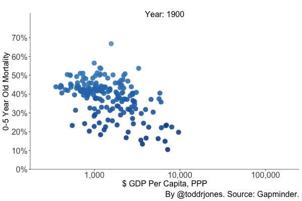

# The Basics

## What is life insurance?

In its simplest form, life insurance is a security blanket for your loved ones. It is there to protect anyone who depends on you financially in the worst-case scenario

<iframe width="560" height="315" src="https://www.youtube.com/embed/8jfk_fuGR28" frameborder="0" allow="accelerometer; autoplay; encrypted-media; gyroscope; picture-in-picture" allowfullscreen></iframe>

## What is term insurance?

Term life insurance is designed to be simple. ​​You pay premiums each month to an insurance company over an agreed length of time. In return, the insurance company promises to give your loved ones a tax-free lump sum cash payment (the “death benefit”) if you die.

Term life insurance pays out a benefit to your beneficiaries only if you die within a specified timeframe, usually 10, 20, or 30 years. This is the best option if you want protection for the years that matter most (when you still have a mortgage & children in the house).

## What's the difference between permanent and term insurance?

There are two main types of life insurance: term & permanent.

Term life insurance is the simplest and most affordable form of life insurance. It pays out a benefit to your beneficiaries only if you die within a specified timeframe, usually 10, 20, or 30 years. This is the best option for 95% of young families.

The alternative (permanent policies) are much more expensive – we are talking hundreds of dollars a month more expensive.  Why? Because it guarantees that your beneficiaries will receive a death benefit. You can die young or die old, and your insurance company will still pay out.

These policies generate high commissions for advisors.  But we don’t like them. For most adults, by the time they’ve reached retirement, they have decided that their savings are enough to support themselves & their families for the rest of their life.  So why do they need life insurance at that point?

