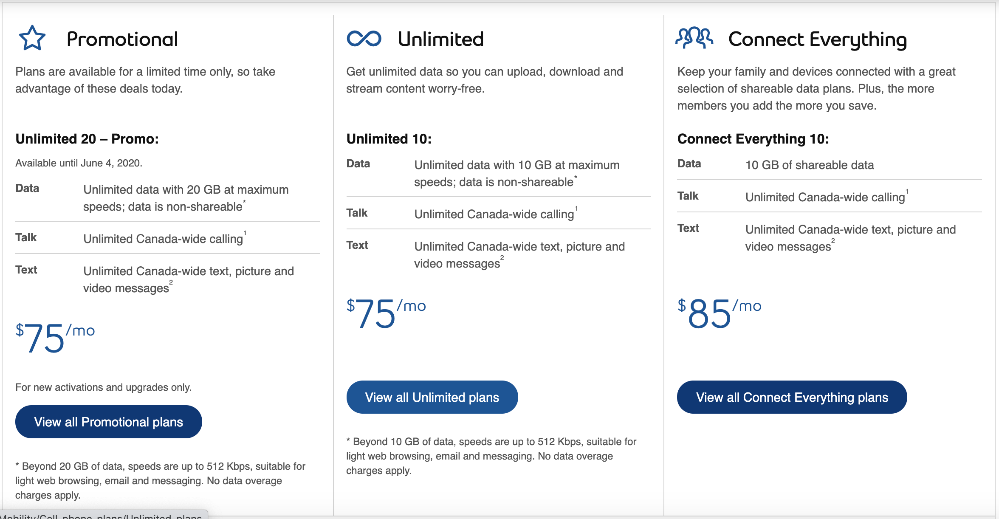

# Products

## How is life insurance priced?

There are many factors that influence the cost of life insurance. That’s why it’s smart to find the best rate for the amount of life insurance you want to buy.

Here are the main factors that will impact your price:
- Age
- Gender
- Smoking status
- Personal health
- Driving history
- Risky hobbies

Let’s talk about each of these individually.

*Your age* – It’s more likely that a 60-year-old will pass away in the next 20 years than a 20-year-old will. That’s why for a 20-year policy, the 60-year-old will end up paying quite a bit more than the 20-year-old. Sorry, folks. There’s no senior’s discount here. 

*Gender* – Believe it or not, this will impact your price. Women are more likely to outlive men. (In fact, their average life expectancy is about 3 years longer.) This means women will get slightly lower prices. 

*Smoking status* – Smoking can harm your health and increase your risk of an early death in many ways. And you can bet that insurance companies know this. That’s why smokers are considered to be about 2x as risky for a life insurance company than nonsmokers and will, therefore, get double the rates compared to their nonsmoking counterparts. The good news is that if you ever stop smoking, insurers will reward you for that! Smokers can always get their rates lowered after the fact (as long as they stop smoking for 12 months straight). So if you were looking for another reason to quit, this is it!

*Personal health* – When you apply for life insurance, insurers scrutinize your health. If you’ve recently had a heart attack or stroke or have had a severe illness in the last 5 years, life insurance companies will increase your rates. The important thing when applying for insurance is to be honest about your health history. Lying about your health is insurance fraud and could lead to a claim being denied, which is MUCH worse than having to pay a higher rate. 

*Driving history* – Driving accidents are a leading cause of death in Canada. That’s why insurance companies will ask if you’ve been in any major driving accidents in the last few years. If you’ve had a DUI or a careless driving charge, this could impact your rates too. When insurers look at your driving history, the last 3 to 5 years carry the most weight.

*Risky hobbies* – If you’re a frequent skydiver or an amateur pilot, you’re probably at a higher risk of an accidental death than the average Canadian without these hobbies is. For this reason, your rate or policy may be impacted by these hobbies.

How do insurance companies collect information on all of these factors? Most of them will ask you to jump on a quick phone call with one of their healthcare professionals to go through 20–30 questions about your health and lifestyle. Some life insurance providers also require a medical exam to assess basic metrics like height, weight, blood pressure, and cholesterol. They’ll use this data to make a final decision about the price of your policy.

